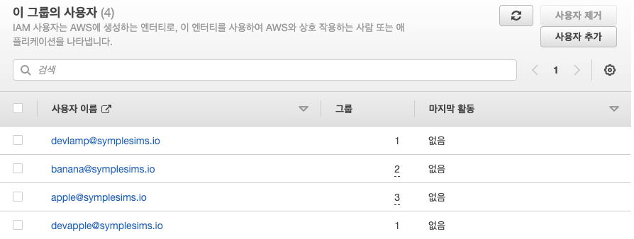

# tfmodule-aws-iam-user

사용자 그룹을 생성하고 액세스 정책 및 사용자 (맴버쉽) 추가를 자동화 하는 테라폼 모듈 입니다.

## Business Challenge

AWS IAM 서비스에서 사용자 및 액세스 정책은 통제 되어야 합니다. 

IAM 에서 사용자 그룹별 액세스 정책을 구성하는 것은 보안 모범 사례 중 하나이며 이를 위해 일반적으로 다음 절차로 구성 할 수 있습니다. 

1. 사용자 그룹을 만듭니다.  
그룹 이름은 해당 그룹이 가지는 권한을 나타낼 수 있도록 설정합니다.
예를 들어, "개발자 그룹"이라는 이름으로 개발자 그룹을 만들 수 있습니다.

2. 사용자 그룹에 연결할 액세스 정책을 추가 합니다.   
사용자 그룹이 하는 역할에 맞는 정책을 최소 권한 부여 원칙에 따라 구성 하고, 추가 되는 사용자는 해당 그룹이 가지는 권한을 상속합니다.

3. 사용자 그룹에 속하는 사용자를 추가합니다. 


이 과정을 AWS 관리 콘솔을 통해 하게 된다면, 사용자 그룹 및 사용자를 초기에 다수 사용자를 추가 하거나 향후 요청이 있을때마다  
IAM 관련 현재 상태를 파악하며 구성하기는 너무나 어려울 뿐만 아니라 최소 권한 부여 원칙과 역할별 사용자의 분리 역시
 어려워 집니다. 

이를 보다 쉽고 자동화된 방식으로 관리 하려면 사용자 그룹과 액세스 정책별 매트릭스로 정의 하고, 여기에 대응하는 IaC 코드를 작성하여 프로비저닝 하는것이 효과적입니다.  
이렇게 관리 하면 사용자 그룹, 정책, 역할별 사용자 현황이 코드에 고스란히 이력으로 남아 있게 되어 현재 상태를 쉽게 파악하고 정확한 상태를 보장할 수 있습니다. 

`tfmodule-aws-iam-user` 테라폼 모듈은 일반적인 사용자 그룹인 
admin, developer, dba, sysadm, viewer 를 그룹을 생성하고, 여기에 적합한 정책 구성과 사용자를 쉽게 관리 할 수 있도록 도와 줍니다. 

<br>

## Usage

```
module "ctx" {
  source  = "git::https://github.com/chiwooiac/tfmodule-context.git"
  context = {
    aws_profile = "prd"
    region      = "ap-northeast-2"
    project     = "apple"
    environment = "Production"
    owner       = "manager@symplesims.io"
    team        = "DevOps"
    cost_center = "20220220"
    domain      = "devops.symplesims.io"
    pri_domain  = "symplesims.backend.intra"
  }
}

module "users" {
  source  = "git::https://github.com/chiwooiac/tfmodule-aws-iam-user.git"
  context = module.ctx.context
  //@formatter:off
  users = [
    { name = "admin@symplesims.io",    create=1, admin=1, developer=0, dba=0, sysadm=0, viewer=0 },
    { name = "manager@symplesims.io",  create=1, admin=0, developer=0, dba=0, sysadm=1, viewer=0 },
    { name = "devlamp@symplesims.io",  create=1, admin=0, developer=1, dba=0, sysadm=0, viewer=0 },
    { name = "devapple@symplesims.io", create=1, admin=0, developer=1, dba=0, sysadm=0, viewer=0 },
    { name = "scott@symplesims.io",    create=1, admin=0, developer=0, dba=1, sysadm=0, viewer=0 },
    { name = "tiger@symplesims.io",    create=1, admin=0, developer=0, dba=1, sysadm=0, viewer=0 },
    { name = "viewer@symplesims.io",   create=1, admin=0, developer=0, dba=0, sysadm=0, viewer=1 },
    { name = "reporter@symplesims.io", create=1, admin=0, developer=0, dba=0, sysadm=0, viewer=1 },
    { name = "cfalron@symplesims.io",  create=1, admin=0, developer=0, dba=0, sysadm=1, viewer=0 },
    { name = "apple@symplesims.io",    create=1, admin=0, developer=1, dba=1, sysadm=1, viewer=0 },
    { name = "banana@symplesims.io",   create=1, admin=0, developer=1, dba=0, sysadm=1, viewer=0 },
  ]
  //@formatter:on  
}

```

<br>

## Input Variables

<table>
<thead>
    <tr>
        <th>Name</th>
        <th>Description</th>
        <th>Type</th>
        <th>Example</th>
        <th>Required</th>
    </tr>
</thead>
<tbody>
    <tr>
        <td>users</td>
        <td>사용자 매트릭스를 구성 합니다.</td>
        <td>list(object)</td>
        <td>an2</td>
        <td>yes</td>
    </tr>
    <tr>
        <td>policies_admin</td>
        <td>Admin 사용자 그룹에 적용할 액세스 정책을 정의 합니다.</td>
        <td>list(string)</td>
        <td>[ "arn:aws:iam::aws:policy/AdministratorAccess" ]</td>
        <td>no</td>
    </tr>
    <tr>
        <td>policies_sysadm</td>
        <td>SysAdm 사용자 그룹에 적용할 액세스 정책을 정의 합니다.</td>
        <td>list(string)</td>
        <td><pre>[
    "arn:aws:iam::aws:policy/AmazonRoute53FullAccess",
    "arn:aws:iam::aws:policy/AWSCertificateManagerFullAccess",
    "arn:aws:iam::aws:policy/AWSKeyManagementServicePowerUser",
    "arn:aws:iam::aws:policy/AmazonEC2FullAccess",
    "arn:aws:iam::aws:policy/CloudWatchFullAccess",
    "arn:aws:iam::aws:policy/CloudWatchLogsFullAccess"
  ]</pre></td>
        <td>no</td>
    </tr>
    <tr>
        <td>policies_dba</td>
        <td>DBA 사용자 그룹에 적용할 액세스 정책을 정의 합니다.</td>
        <td>list(string)</td>
        <td>[ "arn:aws:iam::aws:policy/AmazonRDSFullAccess" ]</td>
        <td>no</td>
    </tr>
    <tr>
        <td>policies_developer</td>
        <td>Developer 사용자 그룹에 적용할 액세스 정책을 정의 합니다.</td>
        <td>list(string)</td>
        <td>[ "arn:aws:iam::aws:policy/AWSCodePipeline_FullAccess" ]</td>
        <td>no</td>
    </tr>
    <tr>
        <td>policies_viewer</td>
        <td>Readonly 사용자 그룹에 적용할 액세스 정책을 정의 합니다.</td>
        <td>list(string)</td>
        <td> [ "arn:aws:iam::aws:policy/ReadOnlyAccess" ]</td>
        <td>no</td>
    </tr>
    <tr>
        <td>policy_path</td>
        <td>Policy 의 IAM 식별자(identifier)를 정의 합니다.</td>
        <td>string</td>
        <td>/</td>
        <td>no</td>
    </tr>
    <tr>
        <td>deny_ipaddr</td>
        <td>이 속성에 정의된 아이피 CIDR 범위를 제외한 모든 IP에 대해서 AWS 접근을 거부 합니다.</td>
        <td>list(string)</td>
        <td>[ "192.0.2.0/24", "203.0.113.0/24", "62.73.2.131/32" ]</td>
        <td>no</td>
    </tr>
    <tr>
        <td>context</td>
        <td>프로젝트에 관한 리소스를 생성 및 자동화 관리에 참조 되는 속성으로 표준화된 네이밍 정책 및 리소스를 위한 메타 정보를 포함하며 이를 통해 데이터 소스 참조에도 활용됩니다.</td>
        <td>object(any)</td>
        <td><pre>
{
  aws_profile = string
  region      = string
  project     = string
  environment = string
  owner       = string
  team        = string
  cost_center = number
  domain      = string
  pri_domain  = string
}</pre></td>
        <td>yes</td>
    </tr>
</tbody>
</table>


<br>


## Outputs

<table>
<thead>
    <tr>
        <th>Name</th>
        <th>Description</th> 
    </tr>
</thead>
<tbody>
    <tr>
        <td>MFAForcePolicy_arn</td>
        <td>MFAForcePolicy ARN 을 출력 합니다. 사용자 그룹 정책에 할당할 수 있습니다.</td> 
    </tr>
    <tr>
        <td>DenyIPAddressPolicy_arn</td>
        <td>DenyIPAddressPolicy ARN 을 출력 합니다. 사용자 그룹 정책에 할당할 수 있습니다.</td> 
    </tr>
</tbody>
</table>


<br>


## 사용자 그룹의 사용자 맴버쉽 매트릭스 정의 

사용자 액세스 권한 매트릭스를 아래와 같이 정의 할 수 있습니다.


| User                    | Admin | Developer | DBA | SysAdm | Viewer | 
|-------------------------|:-----:|:---------:|:---:|:------:|:------:|
| admin@demoasacode.io    |   Y   |           |     |        |        |
| manager@demoasacode.io  |       |           |     |   Y    |        |
| devlamp@demoasacode.io  |       |     Y     |     |        |        |
| devapple@demoasacode.io |       |     Y     |     |        |        |
| scott@demoasacode.io    |       |           |  Y  |        |        |
| tiger@demoasacode.io    |       |           |  Y  |        |        |
| viewer@symplesims.io    |       |           |     |        |   Y    |    
| reporter@symplesims.io  |       |           |     |        |   Y    |
| cfalron@symplesims.io   |       |           |     |   Y    |        |
| apple@symplesims.io     |       |     Y     |  Y  |   Y    |        |
| banana@symplesims.io    |       |     Y     |     |   Y    |        |


위의 매트릭스를 Terraform 의 users 변수로 정의하면 아래와 같습니다. 

```
users = [
  { name = "admin@symplesims.io",    create=1, admin=1, developer=0, dba=0, sysadm=0, viewer=0 },
  { name = "manager@symplesims.io",  create=1, admin=0, developer=0, dba=0, sysadm=1, viewer=0 },
  { name = "devlamp@symplesims.io",  create=1, admin=0, developer=1, dba=0, sysadm=0, viewer=0 },
  { name = "devapple@symplesims.io", create=1, admin=0, developer=1, dba=0, sysadm=0, viewer=0 },
  { name = "scott@symplesims.io",    create=1, admin=0, developer=0, dba=1, sysadm=0, viewer=0 },
  { name = "tiger@symplesims.io",    create=1, admin=0, developer=0, dba=1, sysadm=0, viewer=0 },
  { name = "viewer@symplesims.io",   create=1, admin=0, developer=0, dba=0, sysadm=0, viewer=1 },
  { name = "reporter@symplesims.io", create=1, admin=0, developer=0, dba=0, sysadm=0, viewer=1 },
  { name = "cfalron@symplesims.io",  create=1, admin=0, developer=0, dba=0, sysadm=1, viewer=0 },
  { name = "apple@symplesims.io",    create=1, admin=0, developer=1, dba=1, sysadm=1, viewer=0 },
  { name = "banana@symplesims.io",   create=1, admin=0, developer=1, dba=0, sysadm=1, viewer=0 },
]
```

`users` 변수의 속성은 다음과 같습니다.
- name: 사용자 이름을 정의 합니다.
- create: 1 이면 사용자를 생성 합니다. 0 이면 생성하지 않습니다.
- admin: 어드민 정책 그룹에 사용자를 포함 하려면 1 로 설정합니다.
- developer: 개발자 정책 그룹에 사용자를 포함 하려면 1 로 설정합니다.
- dba: DBA 정책 그룹에 사용자를 포함 하려면 1 로 설정합니다.
- sysadm: System 어드민 정책 그룹에 사용자를 포함 하려면 1 로 설정합니다.
- viewer: ReadOnly 사용자 정책 그룹에 사용자를 포함 하려면 1 로 설정합니다.

<br>

### 사용자 그룹 맴버쉽 프로비저닝 예시  

사용자 그룹 현황은 다음과 같습니다.   


<br>

`appleDeveloperGroup`, `appleDBAGroup` 사용자 그룹의 맴버쉽이 잘 적용되었는지 확인할 수 있습니다. 

- `appleDeveloperGroup` 사용자 그룹의 맴버쉽  

 

<br>

- `appleDBAGroup` 사용자 그룹의 맴버쉽   


<br>

## 사용자 그룹의 액세스 권한 매트릭스 정의

사용자 그룹에 할당할 액세스 정책을 매트릭스로 다음과 같이 정의할 수 있습니다.   

| Policy                             | Admin | Developer | DBA | SysAdm | Viewer |
|------------------------------------|:-----:|:---------:|:---:|:------:|:------:|
| AdministratorAccess                |   Y   |           |     |        |        |
| AmazonRoute53FullAccess            |       |           |     |   Y    |        |
| AWSCertificateManagerFullAccess    |       |           |     |   Y    |        |
| AWSKeyManagementServicePowerUser   |       |           |     |   Y    |        |
| AmazonEC2FullAccess                |       |           |     |   Y    |        |
| CloudWatchLogsFullAccess           |       |           |     |   Y    |        |
| CloudWatchFullAccess               |       |           |     |   Y    |        |
| ReadOnlyAccess                     |       |     Y     |     |        |   Y    |
| AWSCodePipeline_FullAccess         |       |     Y     |     |        |        |
| AmazonAPIGatewayAdministrator      |       |     Y     |     |        |        |
| AWSLambda_FullAccess               |       |     Y     |     |        |        |
| AmazonEventBridgeFullAccess        |       |     Y     |     |        |        |
| AmazonAthenaFullAccess             |       |     Y     |     |        |        |
| AWSCloudFormationFullAccess        |       |     Y     |     |        |        |
| AmazonEMRFullAccessPolicy_v2       |       |     Y     |     |        |        |
| DenyEC2StopAndTerminationMFAPolicy |       |     Y     |     |        |        |
| AmazonDynamoDBFullAccess           |       |     Y     |  Y  |        |        |
| AmazonRDSFullAccess                |       |           |  Y  |        |        |
| AmazonRedshiftFullAccess           |       |           |  Y  |        |        |
| DenyRDSLargeCreationPolicy         |       |           |  Y  |        |        |
| MFAForcePolicy                     |   Y   |     Y     |  Y  |   Y    |   Y    |
| DenyIPAddressPolicy                |       |     Y     |  Y  |   Y    |   Y    |


위의 매트릭스를 Terraform 의 policies 그룹 관련 변수로 정의하면 아래와 같습니다.

```hcl
  policies_admin = [
    "arn:aws:iam::aws:policy/AdministratorAccess",
    module.users.MFAForcePolicy_arn
  ]

  policies_sysadm = [
    "arn:aws:iam::aws:policy/AmazonRoute53FullAccess",
    "arn:aws:iam::aws:policy/AWSCertificateManagerFullAccess",
    "arn:aws:iam::aws:policy/AWSKeyManagementServicePowerUser",
    "arn:aws:iam::aws:policy/AmazonEC2FullAccess",
    "arn:aws:iam::aws:policy/CloudWatchFullAccess",
    "arn:aws:iam::aws:policy/CloudWatchLogsFullAccess",
    module.users.MFAForcePolicy_arn,
    module.users.DenyIPAddressPolicy_arn,
  ]

  policies_developer = [
    "arn:aws:iam::aws:policy/AWSCodePipeline_FullAccess",
    "arn:aws:iam::aws:policy/AmazonDynamoDBFullAccess",
    "arn:aws:iam::aws:policy/AmazonAPIGatewayAdministrator",
    "arn:aws:iam::aws:policy/AWSLambda_FullAccess",
    "arn:aws:iam::aws:policy/AmazonEventBridgeFullAccess",
    "arn:aws:iam::aws:policy/AmazonAthenaFullAccess",
    "arn:aws:iam::aws:policy/AWSCloudFormationFullAccess",
    "arn:aws:iam::aws:policy/AmazonEMRFullAccessPolicy_v2",
    "arn:aws:iam::aws:policy/ReadOnlyAccess",
    module.users.MFAForcePolicy_arn,
    module.users.DenyIPAddressPolicy_arn,
    aws_iam_policy.DenyEC2StopAndTerminationMFAPolicy.arn,
  ]

  policies_dba = [
    "arn:aws:iam::aws:policy/AmazonRDSFullAccess",
    "arn:aws:iam::aws:policy/AmazonRedshiftFullAccess",
    "arn:aws:iam::aws:policy/AmazonDynamoDBFullAccess",
    module.users.MFAForcePolicy_arn,
    module.users.DenyIPAddressPolicy_arn,
    aws_iam_policy.DenyRDSLargeCreationPolicy.arn,
  ]

  policies_viewer = [
    "arn:aws:iam::aws:policy/ReadOnlyAccess",
    module.users.MFAForcePolicy_arn,
    module.users.DenyIPAddressPolicy_arn,
  ]
```

참고로 `MFAForcePolicy`, `DenyIPAddressPolicy` 정책은 users 모듈에서 자동적으로 만들어지며 output 을 통해 참조 할 수 있습니다.  

```
module.users.MFAForcePolicy_arn 
module.users.DenyIPAddressPolicy_arn,
```

`DenyIPAddressPolicy` 정책에 포함될 IP CIDR 대역은 `deny_ipaddr` 속성으로 정의할 수 있습니다.
```hcl
  deny_ipaddr = [
    "192.0.2.0/24",
    "203.0.113.0/24",
    "62.73.2.131/32"
  ]
```


<br>

### 사용자 그룹 액세스 정책 프로비저닝 예시

`appleDeveloperGroup` 그룹과 `appleDBAGroup` 그룹의 액세스 정책을 보면 다음과 같습니다.

- `appleDeveloperGroup` 사용자 그룹의 정책  


<br>

- `appleDBAGroup` 사용자 그룹의 정책  


<br>


## Build

### Pre-Requisite

프로비저닝 하려면 사전에 Terraform 을 실행할 수 있는 AWS 액세스 환경이 준비 되어야 합니다.    

[AWS CLI 설치](https://docs.aws.amazon.com/cli/latest/userguide/getting-started-install.html)
및 [AWS Configure Profile](https://docs.aws.amazon.com/cli/latest/userguide/cli-configure-profiles.html) 환경을 구성 하세요. 

`mystack` 프로파일 구성 예시 
```
aws configure --profile mystack
```

### Simple 예제 

Simple 예제는 기본값을 바탕으로 사용자 관리 및 정책을 구성 하며 [main.tf](./examples/simple/main.tf) 파일을 참조 합니다. 


- Git Clone

```
git clone https://github.com/chiwooiac/tfmodule-aws-iam-user.git
cd tfmodule-aws-iam-user/examples/simple
```

- Terraform Build

```
terraform init --upgrade

terraform plan

terraform apply
```

- Terraform Destroy

```
terraform destroy 
```

<br>


### Custom 예제 

Custom 예제는 사용자 관리형 정책을 추가하고 사용자 그룹에 할당할 수 있습니다.  예제 코드는 [main.tf](./examples/custom/main.tf) 파일을 참조 합니다.  
 


#### Build Custom

- Git clone
```
git clone https://github.com/chiwooiac/tfmodule-aws-iam-user.git
cd tfmodule-aws-iam-user/examples/custom
```

- Terraform Build
```
terraform init --upgrade

terraform plan

terraform apply
```

- Terraform Destroy

```
terraform destroy 
```

<br>


## References

- [AWS IAM User Management Practice](https://symplesims.github.io/aws/security/2023/02/15/iam-user-management-practice.html)  
- [IAM Getting Start](https://docs.aws.amazon.com/IAM/latest/UserGuide/getting-started.html)   
- [IAM Policies examples](https://github.com/awsdocs/iam-user-guide/tree/main/doc_source)   
